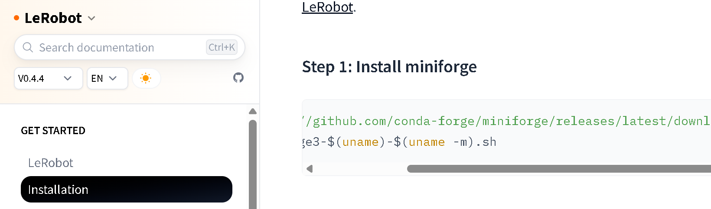
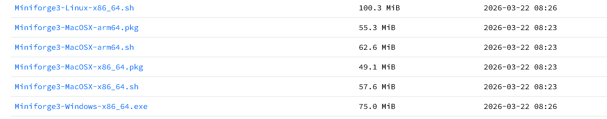

# lerobot适配jaka数据采集

## 环境配置

### 安装lerobot

- 如果有梯子直接访问lerobot官网下载教程进行下载，跳过下列步骤，注意下载0.4.4的版本

- https://huggingface.co/docs/lerobot/v0.4.4/en/installation
  

### 安装miniforge3

- 已有conda环境可跳过
  
- 通过清华镜像站下载 https://mirrors.tuna.tsinghua.edu.cn/github-release/conda-forge/miniforge/LatestRelease/（任选windows-x86_64版本即可）
  

### 安装git bash

### 安装 lerobot

- 在 git bash 中依次执行以下命令：

  ```bash
  # 创建虚拟环境
  conda create -y -n lerobot python=3.10

  # 激活虚拟环境
  conda activate lerobot

  # 克隆仓库（版本 0.4.4）
  git clone -b 0.4.4 https://github.com/huggingface/lerobot.git

  # 进入目录
  cd lerobot

  # 以可编辑模式安装
  pip install -e .
  ```

### 下载项目包

- 建议将项目文件解压缩到之前下载的lerobot目录下

## 项目结构

- lerobot_robot_jaka 适配lerobot的jaka接口实现
- lerobot_teleoperator_jaka_teleop 适配lerobot的遥操作实现
- jakaAPI.dll等 jaka的python SDK
- test_teleop.py 测试遥操作模块
- test_motor.py 测试主臂舵机，以及是否能正确转换为jaka关节运动信息
- record.py 主臂从臂数据采集程序
- dataset_merge.py 多个数据集合并程序
- act_model.py 本地ACT模型推理程序

## 运行教程

### 1 配置机械臂

- 连接同构机械臂的数据线和节卡机械臂网线，确定同构机械臂对应的端口号和节卡机械臂的ip
  
- 修改test_motor.py中对应配置部分并运行，测试主臂舵机数据能否正常读取并转换为jaka关节数据，实现同步的遥操作
  
- 修改lerobot_teleoperator_jaka_teleop/lerobot_teleoperator_jaka_teleop/config_jaka_teleop.py中的PORT为主臂对应实际端口号
  
- 修改test_teleop.py中的SLAVE_IP为对应节卡机械臂的实际ip，运行并测试能否正常校准与遥操作
  
### 2 数据采集
- record.py中修改录制配置部分（从臂ip，相机配置，任务描述，一次采集时长等）
  
- 运行record.py，连接成功后按回车进行主从臂校准，等待运动完成后按回车开始本次数据采集

### 3 数据集合并
- 若多次进行录制得到多个数据集，可以运行dataset_merge.py进行数据集合并（更改对应数据集目录）
  
- 若有huggingface平台账号且可以访问，可以将数据集进行上传

### 4 模型训练
- 云服务器上参照之前lerobot环境配置说明进行配置

- ACT训练lerobot原生已支持，参考lerobot官方教程的act训练命令：

  ```bash
  lerobot-train \
    --dataset.repo_id=${HF_USER}/your_dataset \
    --policy.type=act \
    --output_dir=outputs/train/act_your_dataset \
    --job_name=act_your_dataset \
    --policy.device=cuda \
    --wandb.enable=true \
    --policy.repo_id=${HF_USER}/act_policy
    ```

### 5 模型推理
- 以ACT为例
  
- 将云服务器上的模型训练文件pretrained_model文件夹传输到本地和机械臂连接的设备上，修改act_model.py中对应配置运行即可


# 一些开发注意事项
- 同构机械臂使用30W 5V的电源（较小的那个） 
- 由于关节1 4 6在jaka中可从-360到360，若想处理跳变需要追踪多圈，目前统一用-180到180处理，因此同构机械臂需注意这些关节只能在零点附近移动±180度，否则会出现跳变
- 注意很诡异的一个地方，由于校准时使用的是joint_move普通模式移动关节，这时会自动退出servo_mode，后续发送的servo_j指令是无法执行的，每次joint_move后要重新进入servo_mode